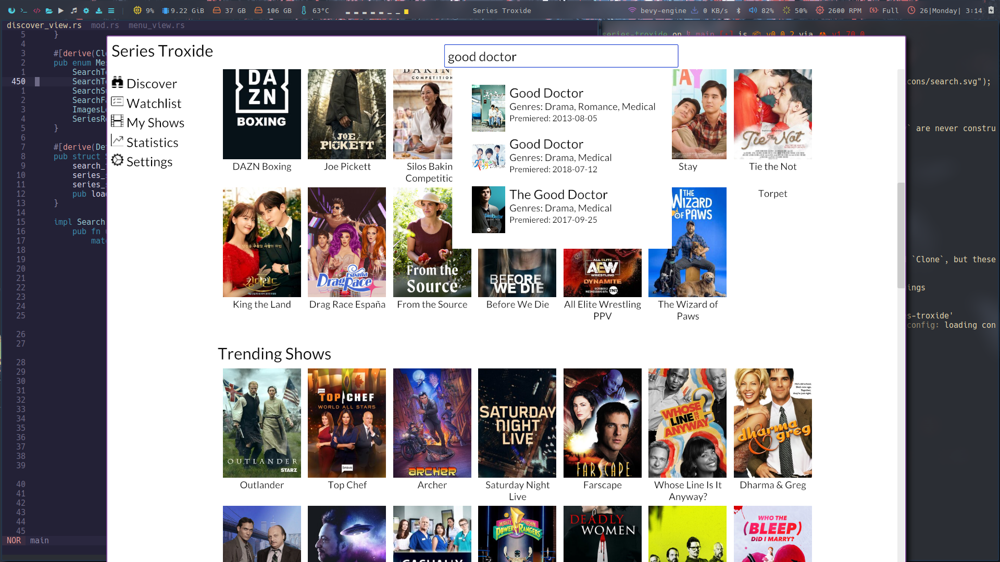

# Series Troxide

A modern Series/Tv Shows Tracker written in Rust.



## WARNING

Series Troxide is in the very early stages of development. A lot of stuffs can and will change.

## Installation
Binaries will be provided when the program starts becoming usable. For now, you can test it out by compiling it from source assuming you have Cargo and Rustc set up on your machine. You can check the [guide](https://rustup.rs/) incase you're not setup.

```shell
git clone https://github.com/MaarifaMaarifa/series-troxide
cd series-troxide
cargo install --path .
```

## Credit
The [API](https://en.wikipedia.org/wiki/API) used by **Series Troxide** is provided by **TVmaze** Licenced under [CC BY-SA](https://creativecommons.org/licenses/by-sa/4.0/). You can check out their site [here](https://www.tvmaze.com/).
