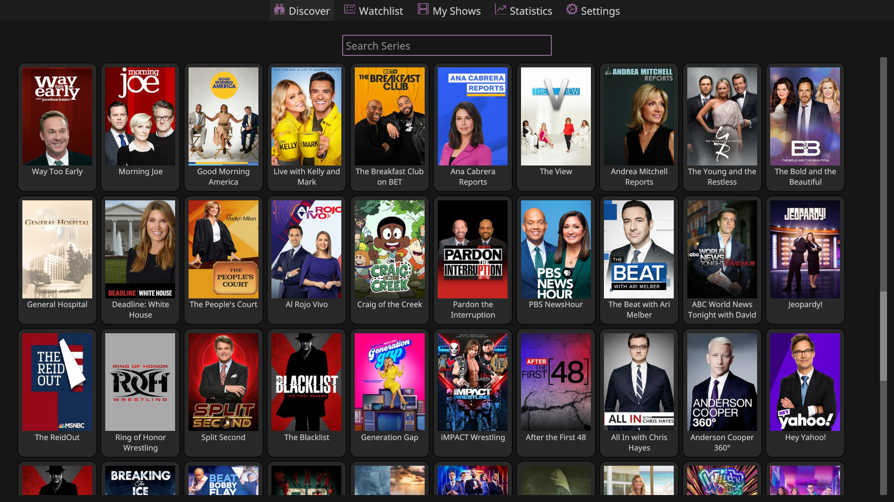
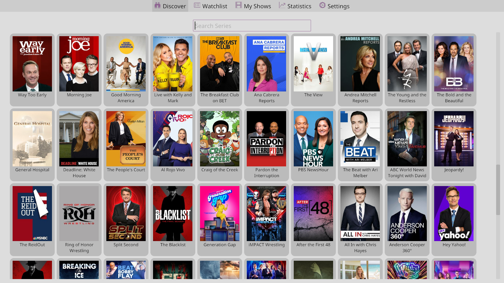
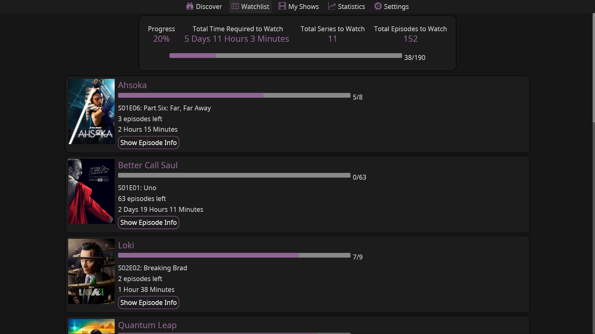
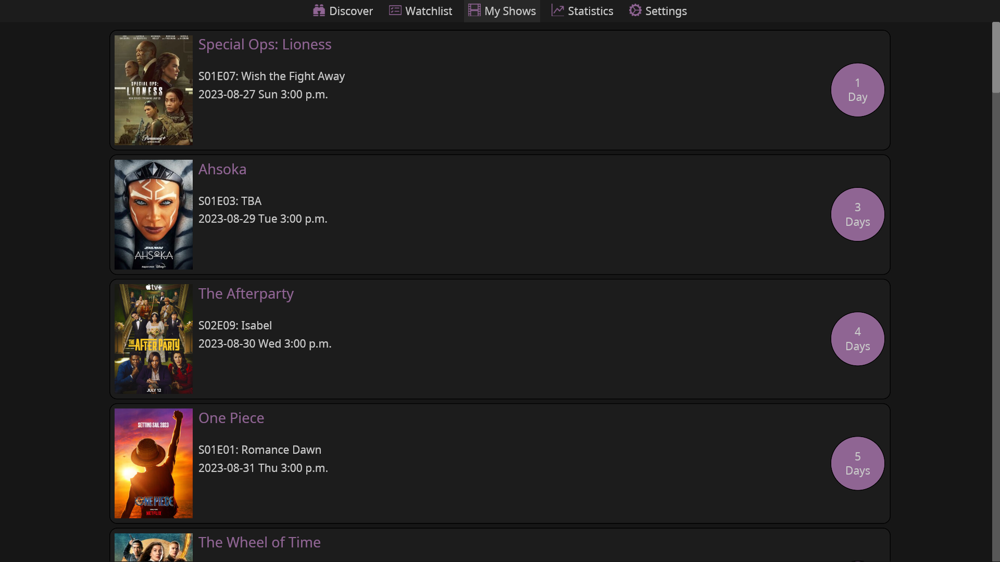
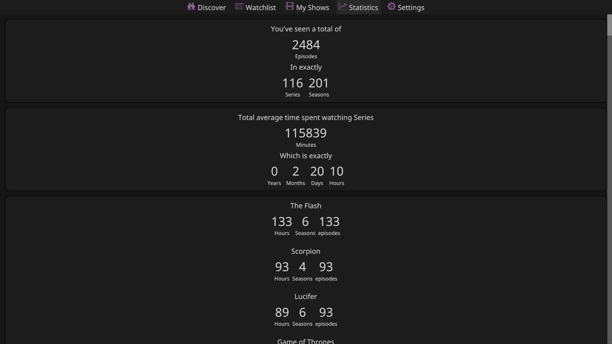

# Series Troxide

A modern Series Tracker.



## WARNING

Series Troxide is in the very early stages of development. A lot of stuffs can and will change.

## Features
- **Aired and New Series discovery**. See what's new worldwide (**Series Troxide** defaults to US for local aired shows discovery for now, but will be more flexible in the future).
- **Series search**. Search for your favourite Series.
- **Upcoming releases**. See when your tracked series are being aired.
- **Series Information**. See general information of any series (Summary, genres, casts, etc).
- **Series Categorization**. See which of your series are running, ended and untracked.
- **Series watch progress tracking**. See what season and episode you left off and how many are left.
- **Series Statistics**. See how many series, seasons and episodes you have watched and how much time you've spent watching them with their sorted list.
- **Light and Dark themes**. Use **Series Troxide** at any time of the day.
- **Caching**. Due to the rate limit of the API, caching makes **Series Troxide** fast when opening previously opened items and be able to perform crazy things like getting the statistics of all watched series. You may notice some stuffs won't get updated though because expiration system for caching has not been implemented yet, but you can just clear the cache manually for now.
- **Notifications for upcoming episodes**. _in progress_.
- **Database export and import**. _in progress_.

## Installation

### Getting pre-built binaries
Pre-built binaries for your specific platform can be obtained from the [release page](https://github.com/MaarifaMaarifa/series-troxide/releases)

### Cargo ([crates.io](https://crates.io/crates/series-troxide))
```shell
cargo install series-troxide
```
### Building from source.
You can build **Series Troxide** from source assuming you have Git, Cargo and Rustc set up on your machine. You can check the [guide](https://rustup.rs/) incase you're not setup.
```shell
git clone https://github.com/MaarifaMaarifa/series-troxide
cd series-troxide
cargo install --path .
```
## More Screenshots





## Credit
- The [API](https://en.wikipedia.org/wiki/API) used by **Series Troxide** is provided by **TVmaze** Licenced under [CC BY-SA](https://creativecommons.org/licenses/by-sa/4.0/). You can check out their site [here](https://www.tvmaze.com/).
- The icons used are provided by **bootstrap icons**. You can check out their site [here](https://icons.getbootstrap.com/).
