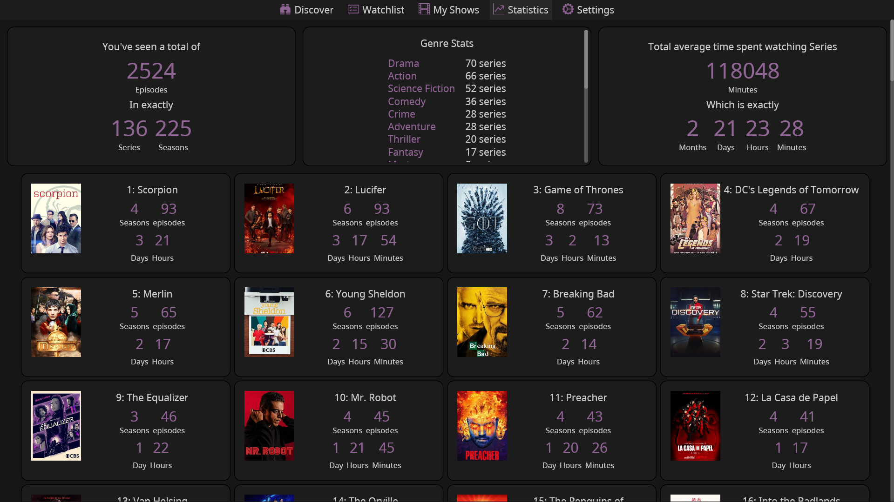

<div align="center">
  
  <h1><strong>Series Troxide</strong></h1>
  <p>
    <strong>A Simple and Modern Series Tracker</strong>
  </p>
  <p>
    <a href="https://github.com/MaarifaMaarifa/series-troxide/actions">
        
    </a>
    <a href="https://crates.io/crates/series-troxide"></a>    
  </p>
</div>

<p align="center">
    
    
</p>
<p align="center">
    
    
</p>
<p align="center">
    
    
</p>

## Features
- [x] **Aired and New Series discovery**. See what's new globally and locally.
- [x] **Series discovery based on categories**. See series based on Networks, webchannels and genres.
- [x] **Series search**. Search for your favourite Series.
- [x] **Upcoming releases**. See when your tracked series are being aired.
- [x] **Series Information**. See general information of any series (Summary, genres, casts, other suggestions based on the series etc).
- [x] **Series Categorization**. See which of your series are running, ended and untracked.
- [x] **Series watch progress tracking**. See what season and episode to continue from, how many episodes are unwatched and how much time required to complete watching all of them.
- [x] **Series Statistics**. See how many series, seasons and episodes you have watched and how much time you've spent watching them in an ordered way.
- [x] **Light and Dark themes**. Use **Series Troxide** at any time of the day.
- [x] **Data export and import**. Carry your series tracking data anywhere.
- [x] **Caching**. Due to the rate limit of the API, caching makes **Series Troxide** fast when opening previously opened items and be able to perform crazy things like getting the statistics of all watched series. Cache cleaning can be managed both automatically and manually to make sure the program does not have outdated series data.
- [x] **Notifications for upcoming episodes**. Configure when to get notified before an episode release.
- [ ] **Trakt integration**.

## Installation

### Getting pre-built binaries
Pre-built binaries for your specific platform can be obtained from the [release page](https://github.com/MaarifaMaarifa/series-troxide/releases)

### Building
**Series Troxide** depends on [**rfd** crate](https://github.com/PolyMeilex/rfd) for opening up a file picker. When building for **Linux and BSD** systems, [GTK3 Rust bindings](https://gtk-rs.org/) are required. The package names on various distributions are;

|Distribution   | Installation Command   |
|:--------------|:-----------------------|
|Fedora         |dnf install gtk3-devel  |
|Arch           |pacman -S gtk3          |
|Debian & Ubuntu|apt install libgtk-3-dev|

When building the project, Cargo has been configure to use the LLD linker for faster linking on linux. To install LLD, find your distro below and run the given command:

|Distribution   | Installation Command   |
|:--------------|:-----------------------|
|Arch           |sudo pacman -S lld      |
|Debian & Ubuntu|sudo apt-get install lld|

#### From Cargo ([crates.io](https://crates.io/crates/series-troxide))
**Series Troxide** is available in crates.io and can be installed using Cargo.
```shell
cargo install series-troxide
```
#### From source.
You can build **Series Troxide** from source assuming you have Git, Cargo and Rustc set up on your machine. You can check the [guide](https://rustup.rs/) incase you're not setup.
```shell
git clone https://github.com/MaarifaMaarifa/series-troxide
cd series-troxide
cargo install --path .
```

#### Building docker image.
```shell
docker build --tag series-troxide:latest https://github.com/MaarifaMaarifa/series-troxide.git#main:/
mkdir /opt/appdata/series-troxide
docker run -v /opt/appdata/series-troxide:/config --rm -it -p 3000:3000 series-troxide bash
```
Hop into [http://localhost:3000](http://localhost:3000) and you will be presented with a ``Series Troxide`` window.

## Credits
- The API used has been provided by TVmaze, you can check out the site [here](https://www.tvmaze.com/).
- The Icons used have been provided by boostrap icons, you can check out the site [here](https://icons.getbootstrap.com/).
- The Graphical User Interface has been made using Iced, you can check out the site [here](https://iced.rs/).
- The UI design has been inspired by the [Hobi Mobile app](https://hobiapp.com/)
